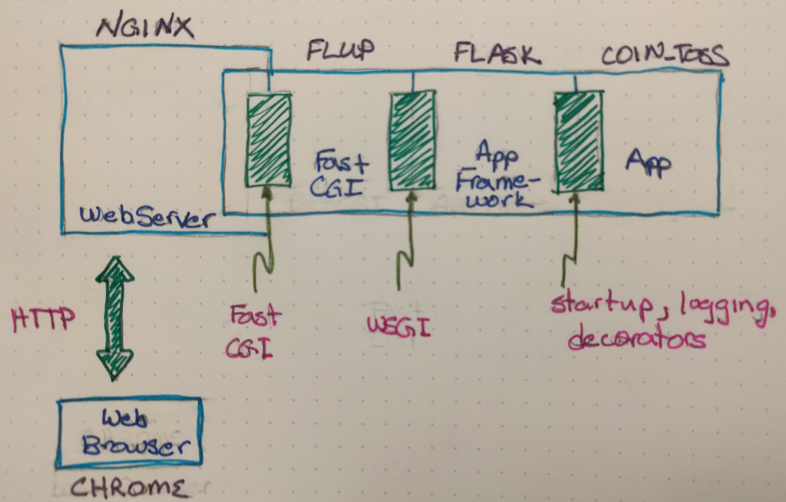

# Simple Flask Application

##Steps:

##Part I - Get it running

###(1) Install a web server

This is the application that runs in the background and processes HTTP protocol requests.  For
this demonstration, we will use the NGINX web server on our OSX laptops.

    brew update
    brew install nginx

Now that the web server is installed, we are ready to test it.  Later, you may want to start
the server on machine start up. Today, we will start it manually. Be sure to start it again
when you need it after you have restarted your computer.

To start the server

    sudo nginx

Now visit http://localhost:8080. You should get "Welcome to nginx!" message if everything went
well.

###(2) Install a gateway module for communication between our application and the web server
For this example, we will use fastcgi.  To install this module,

    brew install fastcgi 

###(3) Install the application requirements
    
    pip install numpy matplotlib
    pip install flask flup

###(4) We need to set a user for the web server
The web server will run as a specified user. When the web server was installed, the default
behavior is to run as "nobody". This won't work for us because "nobody" has the wrong permissions.
(But that doesn't mean everybody has the right permissions!).

Edit the file /opt/twitter/etc/nginx/nginx.conf.  Add a single line immediately after the line 
that starts "#user..." (line 3):
    
    ...
    user <your user name> staff;
    ...

For example, my file:

    ...
    #user  nobody;
    user shendrickson staff;
    worker_processes  1;
    ...

###(5) Move into the Scripts directory and deploy the application

    cd scripts
    ./deploy.sh

If all goes well, you shouldn't see any errors.

##Part II - See how it works

###(6) Rejoice!

To understand the workings of the code, follow along as we explore the application tree.  

The gist of the strategy that drives this structure is to keep everthing in an orderly 
github repository that includes scripts for rapidly deploying the code and configs
without major changes to the structure from here to the web server's live directory
structure. Configs are spread around a bit, but this is handled by our deploy
script.

    |____app
    | |____coin_toss.fcgi
    | |____coin_toss.py
    | |____templates
    | | |____info.html
    | | |____table.html
    |____configs
    | |____coin_toss.conf
    |____README.md
    |____scripts
    | |____deploy.sh

###(7) Logs

There are two types of logs to pay attention to: Access Logs and App Error Logs. With
the configuration here, they are in the respective locations illustrated below. For
now, open a new terminal window and start watching some logs:

* tail -f /opt/twitter/var/log/nginx/coin_toss_server.access.log
* tail -f /var/log/system.log

###(8) Follow the worksings through the files

(1) Start by opening deploy.sh. The deploy script gets configs in the right place, moves the app
    to the live web server directory tree and restarts the server.
(2) Open coin_toss.conf. This config file tells the nginx server how to load our connector 
    component into nginx and route requests to our application.
(3) Open coin_toss.fcgi. This starts our WSGI interface module and connects to the fcgi module.
(4) Open coin_toss.py. Defines the interface and functionality of the application

###(9) Try the APIs

* http://localhost:8090/coin_toss/info.html
* http://localhost:8090/coin_toss/ensemble
* http://localhost:8090/coin_toss/ensemble/summary
* http://localhost:8090/coin_toss/ensemble/table.html
* http://localhost:8090/coin_toss/ensemble/csv
* http://localhost:8090/coin_toss/plot/demo.png
* http://localhost:8090/coin_toss/plot/hist/100_100_500.png

